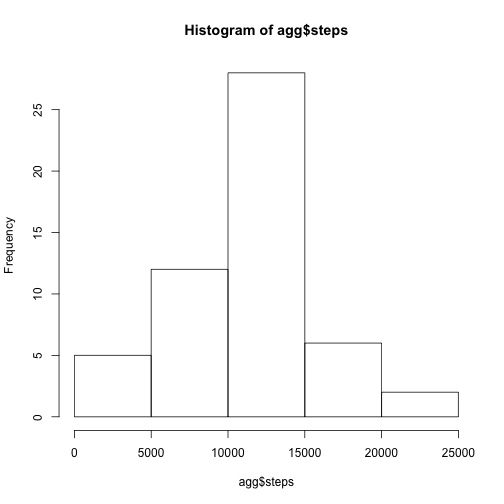
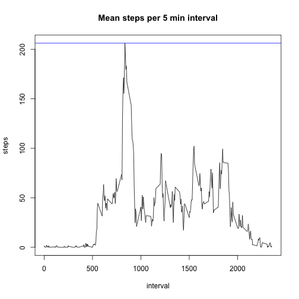
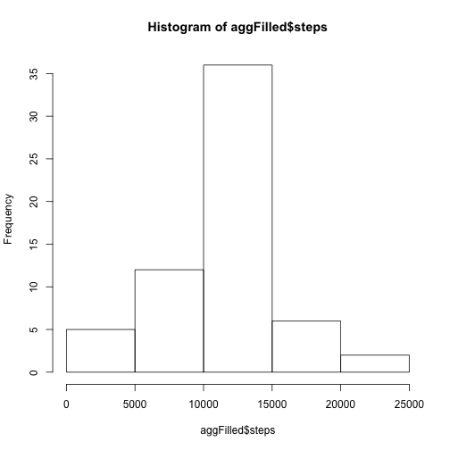

# Step Data

In this class project, we'll examine step data collected from activity
monitoring devices.

## Loading and preprocessing the data

Here, we load in our activity data, calculate the total number of steps per
day, and plot a histogram of the distribution of total number of steps per day:


```r
unzip("activity.zip")
totalActivity <- read.csv("activity.csv")
activity <- totalActivity[complete.cases(totalActivity),]
agg <- aggregate(steps ~ date, activity, sum)
hist(agg$steps)
```



## What is mean total number of steps taken per day?


```r
actMean <- mean(agg$steps)
actMedian <- median(agg$steps)
```

The mean number of steps per day is **10766** and the median is **10765**.

## What is the average daily activity pattern?

Here, we calculate the mean number of steps per 5 minute interval across
all days.  The horizontal line represents the peak average steps per interval.


```r
avgPerInt <- aggregate(steps ~ interval, activity, mean)
plot(avgPerInt, type = 'n', main = 'Mean steps per 5 min interval')
lines(avgPerInt)
maxSteps <- max(avgPerInt$steps)
abline(h = maxSteps, col = 'blue')
```



The max number of steps recorded per 5 min time interval during the time period
is **206**.

## Imputing missing values


```r
hasMissing <- totalActivity[!complete.cases(totalActivity),]
numMissing <- nrow(hasMissing)
numStepsMiss <- sum(is.na(hasMissing$steps))
numDateMiss <- sum(is.na(hasMissing$date))
numIntervalMiss <- sum(is.na(hasMissing$interval))
```

There are a total of **2304** records with missing values.
Of those records, **2304** had steps missing,
**0** were missing dates, and
**0** were missing intervals.

Now previously, we filtered out missing data.  We're going to load the data
again, but this time, any missing step data will be filled in with the
average number of steps for that 5 minute time chunk.


```r
filledMissing <- data.frame(totalActivity)
for (i in 1:nrow(filledMissing)) {
    if (is.na(filledMissing[i,]$steps)) {
        val <- avgPerInt[avgPerInt$interval == filledMissing[i,]$interval,]$steps
        filledMissing[i,]$steps <- val
    }
}
```

Here's a histogram of the distribution of the total number of steps per day,
but with missing the data filled in:


```r
aggFilled <- aggregate(steps ~ date, filledMissing, sum)
hist(aggFilled$steps)
```



We'll also compare the mean and median with the missing data filled in:


```r
actMeanFilled <- mean(aggFilled$steps)
actMedianFilled <- median(aggFilled$steps)
```

The mean number of steps per day is **10766** and the median is **10766**.

Previously, it was **10766** and
**10765**, so it did not really change.

The difference between including estimates for the missing data and not seems to be it further concentrates the distribution around the mean, but doesn't change it, as we would expect.

## Are there differences in activity patterns between weekdays and weekends?

Let's examine how the average number of steps per 5 minute time interval
across weekends and weekdays.  How do they compare?


```r
isWeekend <- function(days) {
    output <- c()
    for (x in days) {
        if (x %in% c("Saturday", "Sunday")) {
            output <- c(output, "weekend")
        } else {
            output <- c(output, "weekday")
        }
    }
    return(factor(output))
}
filledMissing$weekend <- isWeekend(weekdays(as.Date(filledMissing$date)))
intAggFilled <- aggregate(steps ~ interval+weekend, filledMissing, mean)
library(lattice)
xyplot(intAggFilled$steps ~ intAggFilled$interval | intAggFilled$weekend,
       ylab = "Number of steps",
       xlab = "Interval",
       type = "l",
       layout = c(1,2))
```


We can see that there were perhaps fewer peak steps taken per 5 minute
interval on the weekend, but the steps were distributed more evenly.  The
weekday pattern makes sense in the context of, peoople usually take lots
of steps commuting to work and then are more sedentary throughout the day.

## Generating this report

To generate this report in the R console, do the following:

```
> library(knitr)
> knit2html("PA1_template.Rmd", "PA1_template.html", force_v1 = T)
```
